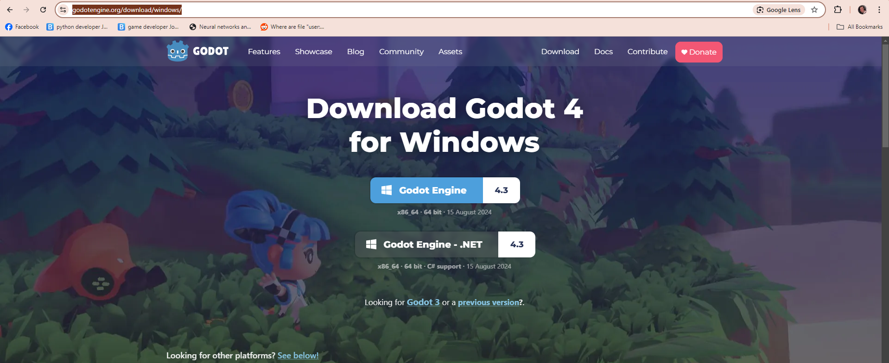
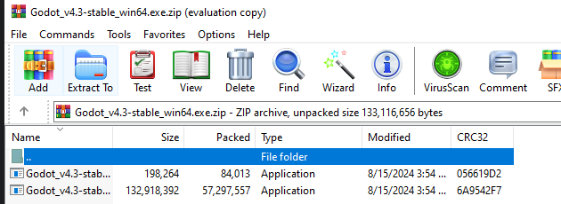
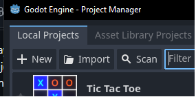
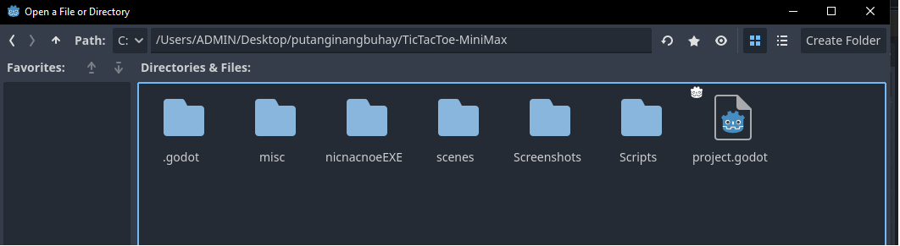

# **Presented by:** 
Abayari, Rob Fritz <br/>
De jesus, Michael Ivan <br/>
Duhaylungsod, Kyziah Mae <br/>
Elomina, Marc Ryzon <br/>
Garcia, John Charles <br/>
Guevarra, Shane Ashley <br/>
Pantonia, John Carlo <br/>
Salamat, Rolph <br/>
Saturno, M-jey <br/>
## Quick start <br/>
**1. clone this repository** 
```console 
$ git clone https://github.com/JCharls1/TicTacToe-MiniMax.git
```
**2. locate where you cloned the project** <br/> 
**3. locate "nicnacnoeEXE" folder then open the application.**

## Build the project on your computer
**1. Download Godot https://godotengine.org/download/windows/** <br/>
<br/>
**2. Clone this repository**<br/>
```console 
$ git clone https://github.com/JCharls1/TicTacToe-MiniMax.git
```
**3. Extract Godot and run the software**<br/>
<br/>
**4. Click import > location of the cloned repository > project.godot**<br/>
<br/>
<br/> 
**5. Press run**<br/>
